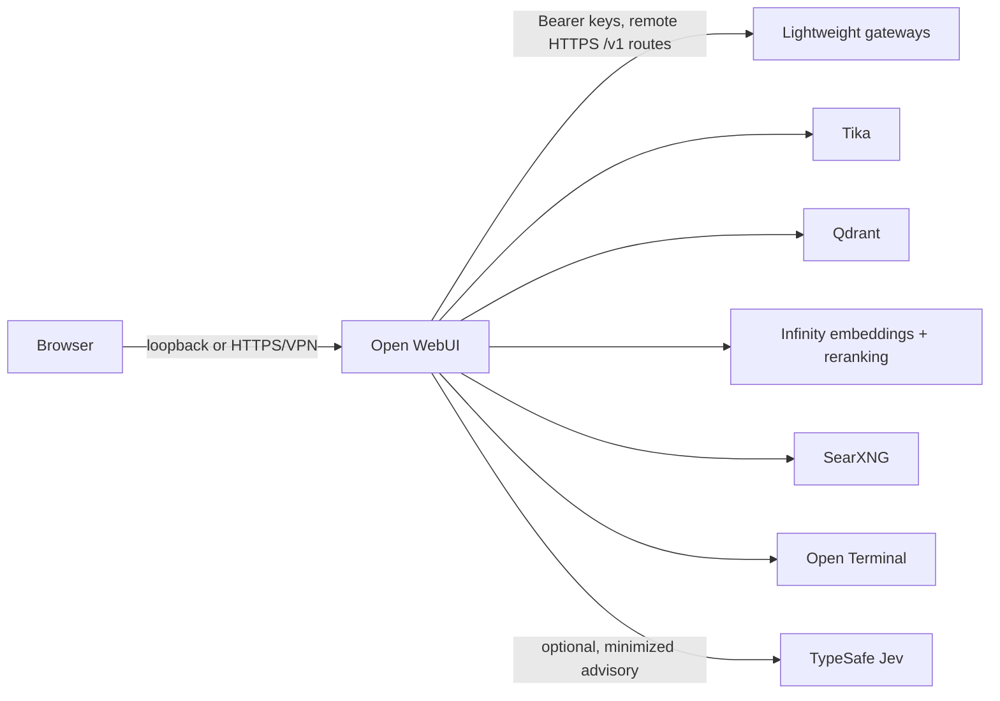

# Lightweight Workbench

This is a private, Open WebUI-style chat layer for Lightweight. It adds document
chat, web search, reranking, and an isolated terminal without changing the
Lightweight gateway's model routing, request scheduler, OpenAI `/v1` contract,
or remote-client authentication.



Only Open WebUI publishes a host port, and it is bound to `127.0.0.1` by
default. Qdrant, Tika, Infinity, SearXNG, and Open Terminal are private
containers. Open Terminal is disabled by default. If enabled, it has no Docker
socket, no host filesystem bind mount, no Linux capabilities, and no egress
network. Its service is limited to 2 CPUs, 2 GiB RAM, and 256 processes.

## Start

1. Deploy each Lightweight route on the capable server with HTTPS, a URL ending
   in `/v1`, and a dedicated API key. Lightweight remains outside Docker.

2. Copy `.env.example` to `.env`. Set the semicolon-separated
   `LIGHTWEIGHT_OPENAI_API_BASE_URLS` and `LIGHTWEIGHT_OPENAI_API_KEYS` lists
   in the same order, then give every matching index in
   `LIGHTWEIGHT_OPENAI_API_CONFIGS` a distinct `prefix_id`.

3. Generate separate SearXNG and terminal secrets.

4. Start the companion stack on the machine chosen to host the workbench:

   ```bash
   docker compose up -d
   ```

5. Open `http://127.0.0.1:3000`, create the first administrator account, then
   select a prefixed Lightweight model such as `fast.llama-3.1`. Use Open
   WebUI's knowledge and web-search controls in a chat to attach documents or
   current sources.

The first start downloads the embedding and reranking models. Subsequent starts
reuse the named volumes.

## Optional terminal

The terminal is disabled unless an administrator starts the optional profile:

```bash
docker compose --profile terminal up -d
```

It is intentionally not connected to Open WebUI automatically. An administrator
must add the private `http://open-terminal:8000` connection and its API key in
Open WebUI after deciding that terminal access is appropriate. Treat that
connection as admin-only for one trusted user. Do not expose it to remote or
multi-user workbench users.

Bare-metal Open Terminal execution is unsupported for remote users because
generated commands would run with the service account's host permissions. Use
the isolated terminal deployment above, or a separately administered container,
Kubernetes, or microVM sandbox. Leave the profile disabled when no such
boundary is available.

## Optional Jev model advice

`Lightweight Auto` is an optional Open WebUI **Pipe Function**. It is an
agent-harness router: it chooses an already configured Lightweight model for a
turn, then hands the request back to Open WebUI's normal completion path. That
preserves Open WebUI's document, search, tool, and terminal controls, and
leaves Lightweight's gateway authentication, scheduling, and remote routing
unchanged.

1. In `.env`, set `LIGHTWEIGHT_AUTO_DEFAULT_MODEL` and include it in
   `LIGHTWEIGHT_AUTO_ALLOWED_MODELS`. Add route-specific models through the
   `JEV_ROUTE_MODELS` JSON map only after each model has been configured in
   Open WebUI and is exposed by Lightweight. Use the prefixed Open WebUI IDs,
   such as `fast.llama-3.1`, not the unprefixed upstream IDs.
2. In Open WebUI, open **Admin Panel → Functions**, create a function, and
   paste [open-webui-functions/lightweight_auto_router.py](open-webui-functions/lightweight_auto_router.py).
   Enable it. It appears in the model picker as **Lightweight Auto**.
3. The pipe is useful without Jev: it deterministically chooses the default
   model. To enable hosted advice, set `JEV_ENABLED=true` and set
   `TYPESAFE_API_KEY`, then recreate Open WebUI with `docker compose up -d`.

When Jev is enabled, the pipe sends HTTPS requests to TypeSafe with only the
latest user prompt (limited by `JEV_MAX_PROMPT_CHARS`) and coarse flags saying
whether documents, web search, or a terminal were selected. It never sends
conversation history, user identifiers, uploaded files, retrieved text,
terminal output, or any Lightweight credential. A timeout, HTTP failure,
invalid response, unknown advisory, low-confidence answer, invalid route map,
or route outside the allowlist selects `LIGHTWEIGHT_AUTO_DEFAULT_MODEL`.
Jev is therefore an opt-in advisor, never a gateway dependency.

### Allowlists and model aliases

Workbench allowlists must use the model identity advertised by each gateway's
`/v1/models`, behind that gateway's prefix. What a gateway advertises depends
on whether the model has an alias:

| Model in Lightweight | Advertised by `/v1/models` | Allowlist entry |
|---|---|---|
| no alias | the canonical id, e.g. `qwen3.5-9b-q8_0@8k` | `fast.qwen3.5-9b-q8_0@8k` |
| alias `Coder` | the alias, `Coder` | `fast.Coder` |

So giving a model an alias, or renaming or clearing one, changes the ID Open
WebUI sees. Update `LIGHTWEIGHT_AUTO_DEFAULT_MODEL`,
`LIGHTWEIGHT_AUTO_ALLOWED_MODELS` and `JEV_ROUTE_MODELS` to match, or the
entry stops matching and the pipe falls back to the default model. Entries are
compared exactly, so use the alias in the casing Lightweight lists it, and
since the allowlist is comma-separated, an alias used here must not contain a
comma. Aliases are the steadier choice: an alias has no `@context` suffix, so
it does not change when the model is loaded at a different context, while an
unaliased canonical ID does. To check what a gateway advertises:

```bash
curl -s -H "Authorization: Bearer $KEY" https://<gateway>/v1/models
```

## Remote use

Keep port 3000 bound to loopback and put Open WebUI behind an authenticated
HTTPS reverse proxy or a private VPN. Do not publish Qdrant, Tika, Infinity,
SearXNG, or Open Terminal. Keep the optional terminal profile disabled for
remote and multi-user workbench deployments. The gateway still independently
validates its Bearer key for every request, so a compromised workbench session
cannot make unauthenticated calls to Lightweight.

## Verify

```bash
docker compose ps
docker compose logs --tail=100 open-webui infinity
curl http://127.0.0.1:3000/health
```

If no Lightweight models appear, check each remote HTTPS `/v1` URL, its
index-aligned key, and the matching route prefix. Open WebUI strips the prefix
before sending a model ID upstream; Jev must use the prefixed model IDs.

## Upgrades

The example uses current upstream image tags so it works out of the box. Before
updating a production installation, replace each image tag in `.env` with the
version you validated, take a backup of the `open_webui_data` and `qdrant_data`
volumes, then recreate the containers.
